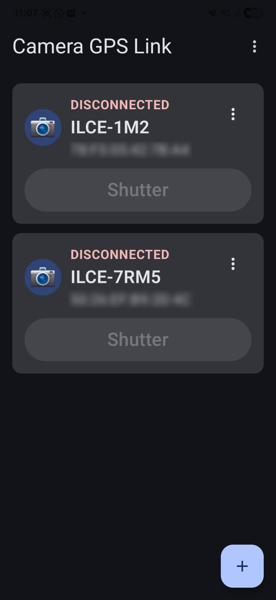
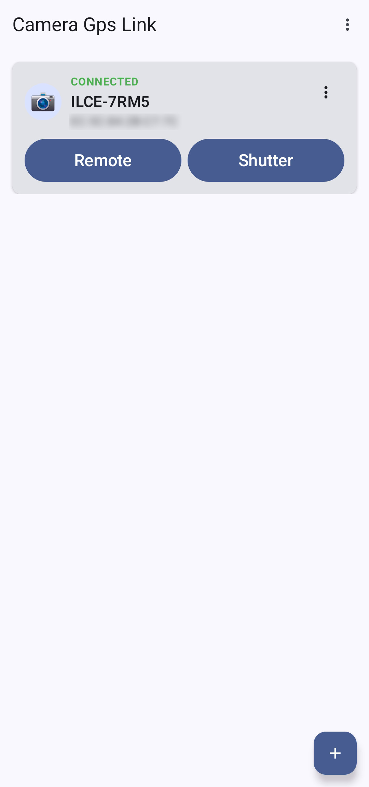

# Camera GPS Link

This Android app provide time and GPS synchronization for recent generations Sony cameras 
that require the Creator's App and don't work with the old Imaging Edge Mobile app.  

This app essentially does the same thing as Location Linking feature in Creator's App,
except it actually works reliably and doesn't randomly turn itself off. 
This issue has affected Creator's App since its first release and Sony are 
unable, or unwilling, to fix it.

### **This app is not associated with or endorsed by Sony**

## Features
* GPS synchronization (Location Linking) that just works
* Time synchronization - keeps the camera time always be synchronized with the 
  Phone's time, including time zone and daylight savings status, 
  which can't be synced automatically when using the Creator's App
* Remote shutter release - A simple and quick shutter release remote control (similar to the shutter button on Sony's RMT-P1BT)   
* Support for connecting multiple cameras
* Two connection modes for best connection speed with all phones and camera combinations

## Screenshots
|  |  |  |  |
|-----------------------------------|----------------------------------|-----------------------------------|-------------------------------|

## Usage
### Pairing the camera with the app
1. On the camera:
   * Go to MENU → Network → Bluetooth → Bluetooth Function - Set to "On"
   * Go to MENU → Network → Bluetooth → Pairing - The camera will enter pairing mode
2. In the app:
   * Press the "+" button to start searching for cameras
   * when the camera is discovered press the "Connect" button to connect to it   
3. Confirm the pairing request on both the camera and the phone
4. Once paired the app will continuously look for the camera and
   will automatically connect to it when it is near by
5. After restarting the phone you have to open the app once for it to work properly.
   The app will show a notification reminding you to open it, which will disappear once you do. 

### Remote Control
1. Enable remote control on the camera:
    MENU → Network → Bluetooth → Bluetooth Rmt Ctrl - Set to "On"
2. In the app either press the "SHUTTER" button on the app's main screen or 
   directly from the notification which is displayed when the app is actively connected to the camera  

**Note** that when remote control is enabled the auto power off feature of the camera is automatically 
  disabled and the camera will have to be manually turned off  

### Settings
Select the "Settings" option from the option from the three dots menu (aka kebab menu) next to the camera:

#### Available Options

* **Connection Mode**
  The implements two different connection modes supported by Android. The technical differences between 
  these modes are not important but what is important is that it seems that Mode 2 connects faster
  for certain camera/phone combinations. It is therefor recommended to just try and see if mode 2
  connects faster for you and if it doesn't just stay with the recommended Mode 1.

* **Quick Connect**
  This feature is only supported when in Mode 1 and will be disabled in Mode 2.
  When enabled the app will search for the camera more aggressively, which will reduce the
  time between turning the camera on and the app connecting to it by 1-2 seconds. This mode
  requires a little more power for scanning, which will drain the battery a bit faster.

* **Quick Connect Duration**
  In order to balance the connection speed and battery usage this feature allows setting 
  a timeout period for the Quick Connect mode. If the camera wasn't found again within the 
  specified time period after being disconnected from the phone, the app will revert to the normal 
  scan speed in order to save battery. Setting this to "Always" means the fast scan speed will always
  be used.
  

### Unpairing
Select the "Remove camera" option from the three dots menu (see above).
Then go to your phone Bluetooth menu and unpair the camera there as well.
Finally unpair the phone from the camera on the camera Bluetooth menu.

### After phone restart
Due to the way location permissions work on Android the app is not 
able to start working after the phone is restarted without it being opened by the user.
Therefor, after a restart the app will display a notification reminding you
to open it, which will disappear once you do.

## Privacy
The app doesn't collect any information so obviously it doesn't send anything to anyone.  
The GPS location is only used locally by the app to send to the camera, it is never collected or shared with anyone.  
The app doesn't connect to the Internet.

## Permissions
The app requires the following permission:  
**Precise Location** - Must be set to "When using the app" - required for providing location information to the camera    
**Nearby Devices** - Required for using bluetooth to connect to the camera    
**Notifications** - Required for showing a persistent notification while the
app is running in the background, waiting to connect with the camera

## FAQ
* **The camera only connects to the app when it is running in the foreground**  
  The app has a background process that is searching for paired cameras all the time,
  even when the app is not active in the foreground. That process is displaying a 
  notification in Android notification center saying "Searching for cameras...", if 
  you dismiss this notification (swipe it out), Android will kill the background process
  and the app won't work until you open the app again.
* **I restarted my phone and now there is a notification to open the app**  
  This is a requirement of Android. Background processes that access the GPS location
  can't start automatically after a phone restart and can only start after the user 
  interacts with the app. Just tap the notification, it will open the app and then you 
  close it until you restart the phone again.
  

### Acknowledgements
This app is inspired by previous work done by:  
[@whc2001](https://github.com/whc2001/ILCE7M3ExternalGps/blob/main/PROTOCOL_EN.md)  
[@XDjackieXD](https://github.com/whc2001/ILCE7M3ExternalGps/issues/3)  
[Greg Leeds](https://gregleeds.com/reverse-engineering-sony-camera-bluetooth/)  
Without them proving that this was even a possible task I never would have spent 
the time on trying to get it to work

## License
MIT license
