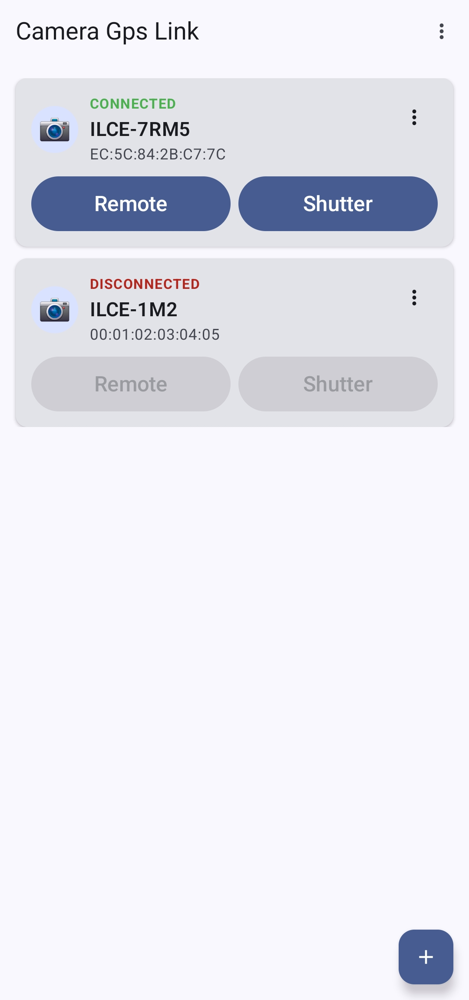
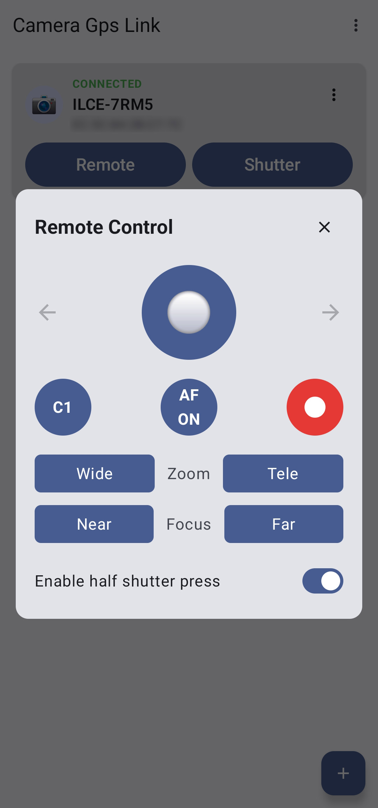
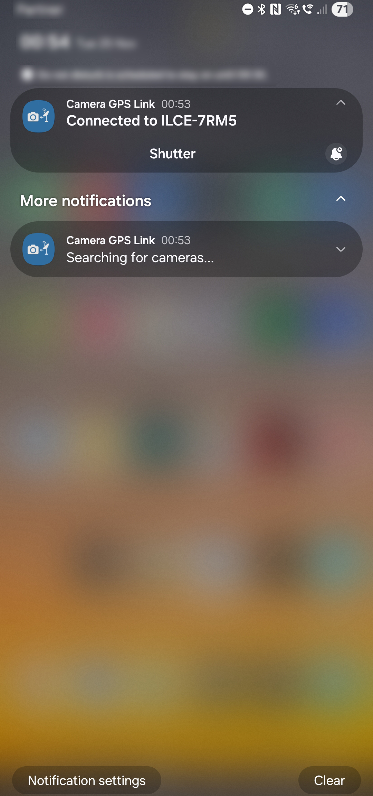
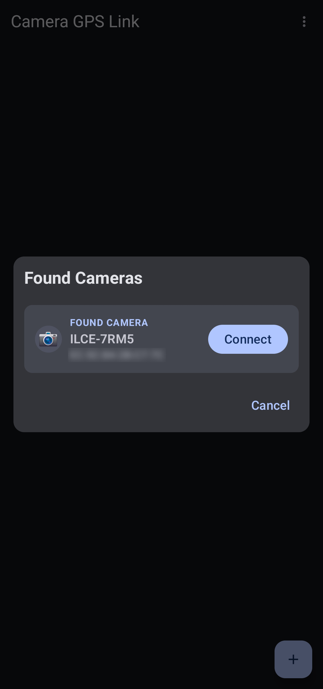
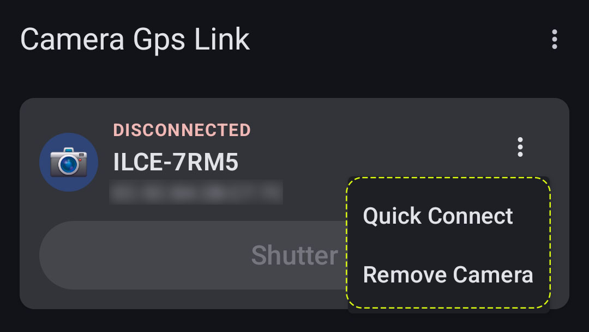
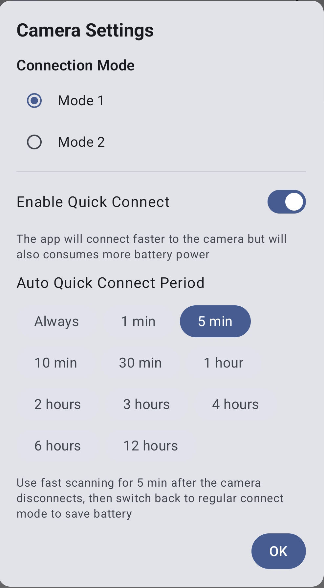

# Camera GPS Link
  
  
  
This Android app provides GPS and time synchronization, as well as full Bluetooth remote control 
for most Sony cameras.

The app essentially does the same thing as Location Linking feature in Creator's App,
except it actually works reliably and doesn't randomly turn itself off. 
This issue has affected Creator's App since its first release and Sony are 
unable, or unwilling, to fix it.  
It also provides a fully featured Bluetooth based remote control with all the functionality 
of Sony's RMT-P1BT and RMT-VP2 remotes.

### **This app is not associated with or endorsed by Sony**

## Features
* **GPS synchronization (Location Linking) that just works**
* **Time synchronization** - keeps the camera time always be synchronized with the 
  Phone's time, including time zone and daylight savings status, 
  which can't be synced automatically when using the Creator's App
* **Full Bluetooth remote control** - Full support for all the feature of 
  Sony's Bluetooth remote controls such as the RMT-P1BT and RMT-VP2   
* Support for connecting multiple cameras
* Two connection modes for best connection speed with all phones and camera combinations
* Now supports camera that use either Sony's Creator's App or Imaging Edge Mobile

## Screenshots
|  |  |  |  |
|-----------------------------------|----------------------------------|-----------------------------------|-------------------------------|

## Usage
### Pairing the camera with the app
1. Start by unpairing the phone from the camera, both on the phone's Bluetooth menu and
   in the camera menu. **DO NOT PAIR AGAIN FROM THE PHONE's BLUETOOTH MENU**
2. Disable Location Information Linkage in Creator's App and Imaging Mobile Edge 
   if they are installed on your phone
3. On Cameras using the old menu system (cameras that use Imaging Edge Mobile app)
   Location Information Linking must be enabled in the camera menu before pairing:
   MENU → Network → Location Info. Link Set. → Location Info. Link - set to "On"
4. On cameras using the new menu system:
   * Go to MENU → Network → Bluetooth → Bluetooth Function - Set to "On"
   * Go to MENU → Network → Bluetooth → Pairing - The camera will enter pairing mode
   On cameras using the old menu system:
   * Go to MENU → Network → Bluetooth Settings → Bluetooth Function - Set to "On"
   * Go to MENU → Network → Bluetooth Settings → Pairing
5. In the app:
   * Press the "+" button to start searching for cameras
   * when the camera is discovered press the "Connect" button to connect to it   
6. Confirm the pairing request on both the camera and the phone
7. Once paired the app will continuously look for the camera and
   will automatically connect to it when it is near by
8. After restarting the phone you have to open the app once for it to work properly.
   The app will show a notification reminding you to open it, which will disappear once you do. 

### Remote Control
1. Enable remote control on the camera.
   * On cameras using the new menu system:
     MENU → Network → Bluetooth → Bluetooth Rmt Ctrl - Set to "On"
   * On cameras using the old menu system:
     MENU → Network → Bluetooth Rmt Ctrl - Set to "On"
   * Turn the camera off and back on again for the app to detect the change
2. Press the "SHUTTER" button in the app app's main screen or directly in the 
   notification which is displayed when the app is actively connected to the camera. 
   This will trigger an immediate shutter release without pre-focusing.
3. Use the "Remote" button in the app to open the full featured remote control.  
   * If "Enable half shutter press" is ON then pressing the shutter button is like 
     half pressing the shutter on the camera. Then you need to drag the button either to 
     the left or to thr right to trigger a full shutter release.  
   * If "Enable half shutter press" is OFF then pressing the shutter button will 
     trigger an immediate shutter release without pre-focusing.
4. The shutter button will turn green when focus is acquired.
5. The video record button will show a "stop record" icon when video recording is active.

**Notes** 
* When remote control is enabled the auto power off feature of the camera is automatically 
  disabled and the camera will have to be manually turned off
* The remote control buttons are simulating a press on the corresponding camera buttons, 
  so they will function in the same way as the corresponding camera button. If you changed 
  the default configuration of these buttons on the camera then they will do the same thing 
  when pressed in the remote control.
* When you enable Bluetooth remote control you will have to turn the camera off and then on again
  so the app can reconnect and discover that remote control has been enabled.
* Some cameras like the a6400 and a7 III do not allow remote control and location linking to be enabled
  at the same time. If you enable one the other one gets automatically disabled. This is a limitation
  of the camera, not the app.

### Settings
Select the "Settings" option from the option from the three dots menu (aka kebab menu) next to the camera:

#### Available Options

* **Camera Name**
  Set a custom name for the camera instead of the name received from the Bluetooth device.

* **Connection Mode**
  The app implements two different connection modes supported by Android.
  In general Mode 1 is the more advanced and recommended mode.
  However, for some users Mode 2 seems to connect faster with their specific
  phone and camera combinations. So it's best to just test it and if you don't see
  a significant difference just use Mode 1 (be sure to test Mode 1 with Quick Connect enabled).
  Notes:  
  * Quick Connect is only supported in Mode 1.
  * Do not use Mode 2 if you enabled the "Cnct. while Power Off" in the camera. 
    See the FAQ below for more information.

* **Quick Connect**
  This feature is only supported when in Mode 1 and will be disabled in Mode 2.
  When enabled the app will search for the camera more aggressively, which will reduce the
  time between turning the camera on and the app connecting to it by 1-2 seconds. This mode
  requires a little more power for scanning, which will drain the battery a bit faster.

* **Quick Connect Duration**
  In order to balance the connection speed and battery usage this feature allows setting 
  a timeout period for the Quick Connect mode. If the camera wasn't found again within the 
  specified time period after being disconnected from the phone, the app will revert to the normal 
  scan speed in order to save battery. Setting this to "Always" means the fast scan speed will always
  be used.
  

### Unpairing
Select the "Remove camera" option from the three dots menu (see above).
Then go to your phone Bluetooth menu and unpair the camera there as well.
Finally unpair the phone from the camera on the camera Bluetooth menu.

### After phone restart
Due to the way location permissions work on Android the app is not 
able to start working after the phone is restarted without it being opened by the user.
Therefor, after a restart the app will display a notification reminding you
to open it, which will disappear once you do.

## Privacy
The app doesn't collect any information so obviously it doesn't send anything to anyone.  
The GPS location is only used locally by the app to send to the camera, it is never collected or shared with anyone.  
The app doesn't connect to the Internet.

## Permissions
The app requires the following permission:  
**Precise Location** - Must be set to "When using the app" - required for providing location information to the camera    
**Nearby Devices** - Required for using bluetooth to connect to the camera    
**Notifications** - Required for showing a persistent notification while the
app is running in the background, waiting to connect with the camera

## Troubleshooting and FAQ
* **I'm getting a "Pairing Error" message in the app**
  This means the app has detected something is wrong with the pairing between the camera
  and the phone. The best way to resolve this issue is just to pair again from scratch:
  1. Remove the camera from the app. The option to remove is in the three dots menu in 
     next to the camera name.
  2. Unpair the camera from the phone in the phone's Bluetooth menu. it may have already 
     been removed by the previous step, if so just verify that it's not listed.    
  3. Unpair the phone from the camera in the camera's Bluetooth menu.
  4. Pair again. First go to the pairing menu in the camera and then add the camera in 
     the app using the "+" button.
  5. Confirm the pairing request on both the camera and the phone.

* **The camera doesn't receive the location information while the phone is locked**  
  The app is being restricted by Android's "battery optimization" feature. Go to the
  Android system settings > Apps > search for Camera GPS Link > Battery > Set to "Unrestricted" 
  If you had to do this please let me know. If I see this is a common issue I'll add 
  a friendlier way of opening that setting page.

* **The camera doesn't receive the location information at all**  
  On cameras that work with Imaging Edge Mobile location linking has to be enabled
  in the camera menu. The menu option is at: 
  *Location Info. Link Set.* > *Location Info. Link* > On
  Also, make sure this is enabled in Creator's App and Imaging Edge Mobile if you 
  have them installed.

* **I enabled Bluetooth remote control but the app still tells me to enable it**  
  If you just enabled it then turn the camera off and then on again. This would allow
  the app to detect that it has been enabled.

* **The camera only connects to the app when it is running in the foreground**  
  The app has a background process that is searching for paired cameras all the time,
  even when the app is not active in the foreground. That process is displaying a 
  notification in Android notification center saying "Searching for cameras...", if 
  you dismiss this notification (swipe it out), Android will kill the background process
  and the app won't work until you open the app again.

* **Once in a while I get a notification to open the app in the phone's notification center**  
  This is a requirement of Android. Background processes that access the GPS location
  can't start automatically after a phone restart or after the app has been upgraded
  from the Play Store, a user interaction is required for it to start. 
  Just tap the notification, it will open the app which will allow the background service
  to work and start searching for cameras.

* **When I enable Bluetooth Remote Control in the camera geotagging stops working**
  This ia limitation of some cameras like the a6400 and the a7 III which do not allow
  remote control and location linking to be enabled at the same time. If you enable one
  the other one gets automatically disabled.

* **I press the "half-shutter" in Remote Control but nothing happens**
  As noted, the remote control does the same thing as pressing the corresponding button
  on the camera. If you disabled the "AF w/ Shutter" option in the camera then it won't
  auto focus when you half press the shutter on the camera and not when using the remote.

* **The camera is turning on even when I power it off**
  You probably have "Cnct. while Power Off" enabled in the camera menu and you've
  set the connection mode in the app to Mode 2. In that mode the app can't detect 
  that Connect while power off is enabled in the camera and will cause it to wake up
  every few seconds. Either disable that feature in the camera, or use Mode 1 in the app.  
  In general, enabling this feature wastes battery power both on the Camera and the phone
  so don't enable it unless you actually need it.

### Acknowledgements
This app is inspired by previous work done by:  
[@whc2001](https://github.com/whc2001/ILCE7M3ExternalGps/blob/main/PROTOCOL_EN.md)  
[@XDjackieXD](https://github.com/whc2001/ILCE7M3ExternalGps/issues/3)  
[Greg Leeds](https://gregleeds.com/reverse-engineering-sony-camera-bluetooth/)  
Without them proving that this was even a possible task I never would have spent 
the time on trying to get it to work

## License
MIT license
